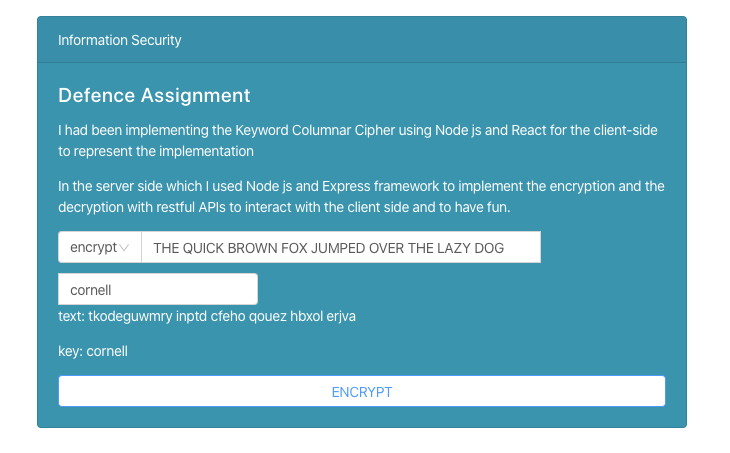

This project from KSU Information security course 
Tasks : 
•   Implement a cryptosystem  
•   Add a user interface 

For this project, I had been implementing the Keyword Columnar Cipher using Node js  and React for the client-side to represent the implementation 

In the server side which I used Node js and Express framework to implement the encryption and the decryption with restful APIs to interact with the client side and to have fun. to try the project please follow the instructions bellow

### first run the server side by running  
`git clone https://github.com/ziyadmsq/Information-Security-UniProject.git` 
`cd Information-Security-UniProject` 
`node server-side/app.js` 

### then run the following for the client side separately 
`cd client-side` 
`npm install` 
`npm start` 

then open a browser and open the URL `localhost:3000` (if it's not open automagically)

output should be like :
